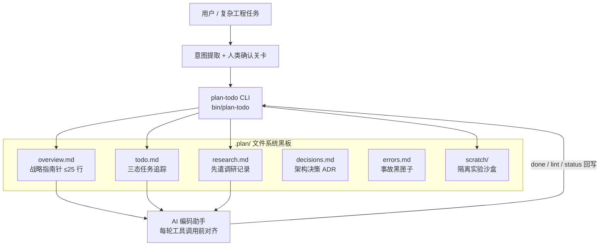

<div align="center">

# 📋 Plan + Todo System

**A Filesystem-Based Task Tracking & Research Protocol for AI Coding Agents**

**文件系统当黑板，Plan 当指南针，Todo 当项目经理——一套为 AI 编码助手设计的任务追踪与先遣调研操盘系统。**


</div>

---

## 📖 目录

- [🌟 项目愿景与核心问题](#-项目愿景与核心问题)
- [🏗 系统架构](#-系统架构)
- [⚡ 核心特性](#-核心特性)
- [🛠️ 技术栈](#️-技术栈)
- [🚀 快速开始](#-快速开始)
- [📁 项目结构](#-项目结构)
- [🧪 测试](#-测试)
- [🗺️ 开发路线图](#️-开发路线图)
- [📚 文档索引](#-文档索引)
- [📄 许可证](#-许可证)

---

## 🌟 项目愿景与核心问题

让 AI 编码助手在长链路、多步骤的工程任务中始终保持战略对齐。系统针对三个反复出现的失效模式：

1. **语义漂移 (Context Drift)**：随着工具调用增多，原始意图被海量 shell 日志与报错信息淹没，Agent 开始追着报错盲目打补丁；
2. **技术幻觉 (Hallucinations)**：Agent 凭概率猜测第三方库的 API、数据库字段类型，写了一堆代码在运行时报废；
3. **缺少战略锚点 (Loss of Focus)**：缺乏顶层约束，任务列表沦为一盘散沙。

本系统通过 **「战略指南针 + 战术三态坐标 + 先遣调研武器库 + 物理沙盒排雷」** 四位一体应对上述问题：所有状态落在项目内的 `.plan/` 目录中，任何支持读写文件的 AI 编码助手装上即可使用，新会话读一遍 `.plan/` 即可恢复完整执行上下文。

### ⚖️ 对照：用 vs 不用

| 维度 | 不用 Plan 系统 | 装备 Plan + Todo + 调研体系 |
|---|---|---|
| **面对复杂未知** | 盲目直接写代码，写错再修，频繁返工 | **Phase 0 先遣调研**，查清 API 与 Schema 再落子 |
| **Agent 行为** | 追着报错修，离原始意图越来越远 | 每步前对齐 `overview.md`，偏离立即熔断 |
| **人类把关** | Agent 擅自抢跑改代码 | **强制人类明确确认红线**，支持用户动态增补 |
| **新会话断点** | 忘光历史，从头开始 | 读 `.plan/` 快速恢复上下文与执行坐标 |

---

## 🏗 系统架构



---

## ⚡ 核心特性

| 特性 | 说明 |
|---|---|
| 🧭 战略指南针 | `overview.md` 强制 ≤25 行，承载北极星目标、阶段拆解、非目标红线与硬约束，`lint` 命令强制校验 |
| 📌 三态任务追踪 | `todo.md` 使用 `[ ]` 待做 / `[~]` 进行中 / `[x]` 已完成三态坐标，`status` 命令输出彩色进度条与当前焦点 |
| 🔍 先遣调研机制 | `research` 命令为未知技术点生成标准调研档案，先查清官方 API 与真实 Schema 再动工 |
| 🧪 隔离沙盒排雷 | `spike` 命令在 `.plan/scratch/` 创建最小 POC 脚本，验证通过后再合入生产主干 |
| 🧠 决策与事故留痕 | `decisions.md` 记录 ADR（日期 · 决策 · 为什么），`errors.md` 沉淀防踩坑记录 |
| 📦 零依赖 CLI | 单文件 Python 标准库实现，Linux / macOS / Windows 通用，Python 3.8+ 即可运行 |

---

## 🛠️ 技术栈

| 层次 | 技术选型 | 说明 |
|---|---|---|
| CLI 核心 | Python 3.8+（仅标准库） | `bin/plan-todo` 单文件实现 6 个子命令 |
| 安装脚本 | Bash | `install.sh` 复制 `.plan/` 模板并检测目标项目环境 |
| 状态载体 | Markdown 文件 | `.plan/` 五件套 + `scratch/` 沙盒目录 |
| 预留依赖 | `requirements.txt` | 列出 pydantic / PyYAML / Rich / Click，当前 CLI 未引用，供后续扩展使用 |

---

## 🚀 快速开始

**前置要求**：Python 3.8+（仅 CLI 需要）；安装模板仅需 Bash。

### 1. 克隆仓库

```bash
git clone https://github.com/CHINGBOH/plan-todo-system.git
cd plan-todo-system
```

### 2. 方式一：在你的项目中初始化 `.plan/` 模板

在**你的目标项目根目录**运行：

```bash
bash /path/to/plan-todo-system/install.sh
```

脚本会创建 `.plan/` 目录并复制 `overview.md`、`todo.md`、`research.md`、`decisions.md`、`errors.md` 五件套模板。

### 3. 方式二：直接使用 CLI（零外部依赖）

```bash
# 建议添加别名
alias plan-todo="python3 /path/to/plan-todo-system/bin/plan-todo"

# 在项目根目录一键初始化
plan-todo init "构建电商可视化大屏"

# 查看当前阶段、执行焦点与彩色进度条
plan-todo status

# 为未知技术点派发先遣调研任务
plan-todo research "ECharts 5 桑基图配置项核实"

# 创建快速验证沙盒（不污染主工程）
plan-todo spike "test_pg_connection"

# 规范检查（强制校验 overview ≤ 25 行与三态规范）
plan-todo lint

# 按关键词或编号推进任务
plan-todo done "1.1"
```

---

## 📁 项目结构

```
plan-todo-system/
├── bin/
│   └── plan-todo            # 零依赖 CLI：init / status / lint / research / spike / done
├── docs/
│   ├── PLAN_SYSTEM.md       # 完整方法论体系
│   ├── RESEARCH_PLAYBOOK.md # 调研工具实战操盘手册
│   └── BOOTSTRAP.md         # AI 工具一键激活协议
├── skills/
│   └── plan-todo/
│       └── SKILL.md         # Agent Skill 定义
├── templates/               # .plan/ 五件套模板
│   ├── overview.md
│   ├── todo.md
│   ├── research.md
│   ├── decisions.md
│   └── errors.md
├── install.sh               # 一键安装脚本
└── requirements.txt         # 预留依赖（当前 CLI 未引用）
```

安装后在你的项目中生成的工作目录：

```
.plan/
├── overview.md        ← 战略指南针（≤25 行），北极星目标、阶段、边界与约束
├── todo.md            ← 战术任务追踪：[ ] 待做 / [~] 正在执行 / [x] 已完成
├── research.md        ← 技术调研与先遣排雷记录
├── decisions.md       ← 架构决策记录（ADR：日期 · 决策 · 为什么）
├── errors.md          ← 事故黑匣子与防踩坑记录
└── scratch/           ← 隔离实验沙盒（用于跑最小 POC 验证）
```

---

## 🧪 测试

仓库当前**没有自动化测试套件**。可用的自检手段是 CLI 内置的规范校验：

```bash
# 校验 .plan/ 文件符合系统约束（overview ≤ 25 行、三态 checkbox 合法）
plan-todo lint
```

为 CLI 补齐单元测试已列入[路线图](#️-开发路线图)。

---

## 🗺️ 开发路线图

- [x] 零依赖 CLI：`init` / `status` / `lint` / `research` / `spike` / `done` 六个子命令
- [x] `.plan/` 五件套模板与一键安装脚本
- [x] 完整方法论文档（PLAN_SYSTEM / RESEARCH_PLAYBOOK / BOOTSTRAP）
- [x] Agent Skill 定义（`skills/plan-todo/SKILL.md`）
- [ ] 为 CLI 补齐自动化单元测试
- [ ] 打包发布为可 `pip install` 的命令行工具
- [ ] 落地 `requirements.txt` 中预留的依赖（Rich 进度渲染、YAML 结构化状态等）
- [ ] `status` 输出支持导出为 Markdown 报告

---

## 📚 文档索引

| 文档 | 说明 |
|---|---|
| [PLAN_SYSTEM.md](docs/PLAN_SYSTEM.md) | 完整方法论体系：Todo 作为项目经理、WBS 100% 穷尽法则、四大经典领域模板库 |
| [RESEARCH_PLAYBOOK.md](docs/RESEARCH_PLAYBOOK.md) | 调研工具实战操盘手册：文档探针、Web 检索、代码库 Grep 与沙盒排雷 |
| [BOOTSTRAP.md](docs/BOOTSTRAP.md) | 一键激活协议：把 Plan 纪律注入 AI 工具的配置文件 |
| [SKILL.md](skills/plan-todo/SKILL.md) | Agent Skill 形式的系统定义 |

---

## 📄 许可证

本项目基于 [MIT License](LICENSE) 开源——自由使用、分发与修改。

---

<div align="center">

**[⬆ 回到顶部](#-plan--todo-system)**

</div>
